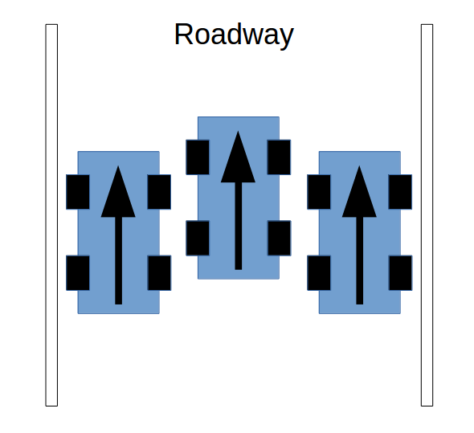
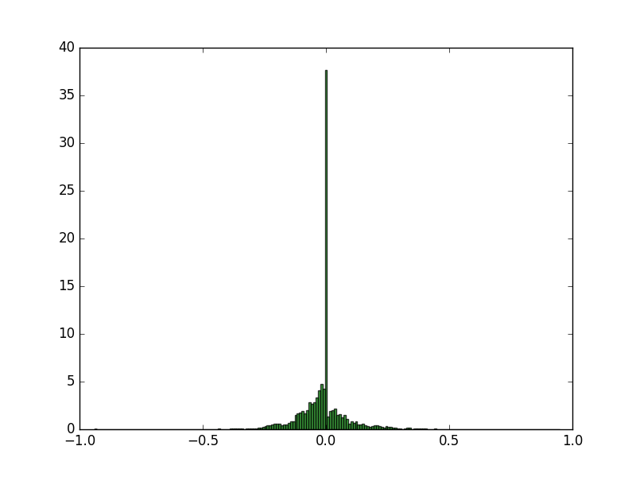

# CarND-Behavioral-Cloning

This README file contains a description of a solution to the Behavioral Cloning project in the Udacity Self-driving Car Nano Degree program. The orgainzation of the discussion is as follows:

1. I describe the model submitted for the project.
2. I describe training data used and how it was generated.
3. I describe the process for developing and evaluating the model.

## Submitted Model

The model that I am submitting is based on a implementation of the model in the NVIDIA paper, End to End Learning for Self-Driving Cars. The Keras model summary is provided in Listing 1, below. 

The core model described in the NVIDIA paper included the following layers:

|Layers|
|---|
|3 5x5 convolution layers|
|2 3x3 convolution layers|
|3 fully connected dense layers|

To the core model, I added several dropout layers and max pooling layers as indicated in Listing 1. The dropout layers are intended to help prevent model overfitting.

***Listing 1: Keras model summary of submitted model.***

```
Layer (type)                           Output Shape          Param #     Connected to                     
====================================================================================================
maxpooling2d_1 (MaxPooling2D)          (None, 80, 160, 3)    0           maxpooling2d_input_1[0][0]       
____________________________________________________________________________________________________
convolution2d_1 (Convolution2D), 5x5   (None, 38, 78, 24)    1824        maxpooling2d_1[0][0]             
____________________________________________________________________________________________________
maxpooling2d_2 (MaxPooling2D)          (None, 37, 77, 24)    0           convolution2d_1[0][0]            
____________________________________________________________________________________________________
dropout_1 (Dropout) p=0.5              (None, 37, 77, 24)    0           maxpooling2d_2[0][0]             
____________________________________________________________________________________________________
convolution2d_2 (Convolution2D), 5x5   (None, 17, 37, 36)    21636       dropout_1[0][0]                  
____________________________________________________________________________________________________
convolution2d_3 (Convolution2D), 5x5   (None, 7, 17, 48)     43248       convolution2d_2[0][0]            
____________________________________________________________________________________________________
maxpooling2d_3 (MaxPooling2D)          (None, 6, 16, 48)     0           convolution2d_3[0][0]            
____________________________________________________________________________________________________
dropout_2 (Dropout) p=0.5              (None, 6, 16, 48)     0           maxpooling2d_3[0][0]             
____________________________________________________________________________________________________
convolution2d_4 (Convolution2D), 3x3   (None, 4, 14, 64)     27712       dropout_2[0][0]                  
____________________________________________________________________________________________________
convolution2d_5 (Convolution2D), 3x3   (None, 2, 12, 64)     36928       convolution2d_4[0][0]            
____________________________________________________________________________________________________
maxpooling2d_4 (MaxPooling2D)          (None, 1, 11, 64)     0           convolution2d_5[0][0]            
____________________________________________________________________________________________________
dropout_3 (Dropout) p=0.5              (None, 1, 11, 64)     0           maxpooling2d_4[0][0]             
____________________________________________________________________________________________________
flatten_1 (Flatten)                    (None, 704)           0           dropout_3[0][0]                  
____________________________________________________________________________________________________
dense_1 (Dense)                        (None, 100)           70500       flatten_1[0][0]                  
____________________________________________________________________________________________________
dense_2 (Dense)                        (None, 50)            5050        dense_1[0][0]                    
____________________________________________________________________________________________________
dense_3 (Dense)                        (None, 10)            510         dense_2[0][0]                    
____________________________________________________________________________________________________
dense_4 (Dense)                        (None, 1)             11          dense_3[0][0]                    
====================================================================================================
Total params: 207,419
Trainable params: 207,419
Non-trainable params: 0
____________________________________________________________________________________________________
```
### Model Fitting

The model was trained with the following parameters:

|Parameter|Description|
|---|---|
|loss function|mean-squared error|
|epochs|early stopping based on the loss function, tolerance 0.001|
|optimizer|Adam optimizer|

The data used for training included 18425 training samples and 7897 validation samples. (See the Data Specifications for Training the Submitted Model section for more details.)

## Training Data

Training data were collected using the simulator in training mode. There are two aspects of the data to consider for successful fitting of a model to predict steering angle:

1. The inclusion of appropriate recovery training data
1. The distribution the steering angle data in the training data

### Recovery Data
In order to build a model that successfully guides the car around the track, it is important to have data that tells the model how to recover when the car approaches the roadway sides. The suggestion in the instructions was to turn the image capture on and off when the car was moving from the edges to the center of the road. In practice this was quite difficult due to the ergonomics of the simulator.

Instead of trying to capture recovery images by driving from the edge to the road to the center, I captured entire laps while driving on the left-hand side of the road and on the right-hand side of the road and saved them into separate folders. With the data captured from a specific location on the roadway in a single directory, appropriate adjustments can be made to the steering angle of all images to simulate recovering from the side of the roadway back to the center of the roadway.

This is shown in Figure 1, below.



**Figure 1: positions on the roadway used to collect training data.**

The way that steering angle adjustments were applied is described in more detail in the Data Generator section below.

### Steering Angle Distribution

A key insight of the training data that helped me progress in building a successful model was that most of the training data contained steering angles of near 0.0 values. The large number of training points with steering angle near 0.0 dominated the learning and made it difficult for the model to "learn" to manuver around sharp corners. (This insight was taken from the forums in a post by Milutin Nikolic). The distibution of steering angle values from a sample data set is shown in the figure below.



**Figure 2: Distribution of steering angles in the data set used to train the model**

As figure 2 shows, the number of samples in which the steering angle is very near zero is several times larger than the number of samples for steering angles greater than zero. To compensate for this, I filtered out a given percentage of the values near zero when generating data for the model fit runs. This is described in more detail in the Data Generator section below.

### Data Generator

I used a data generator to facilitate both the recovery data and the filtering of near-zero values. The generator is coded as a python class. The class constructor method is shown here:

```
SimulatorGenerator(data, include_params)
```

The ```data``` parameter allows one or more datasets to be specified as inputs to the generator. The generator expects the data parameter to contain a list of tuples. Each tuple contains a the name of a directory and a list of tuples each of which contains a camera and a steering adjustment. Here is an example of specifying three data directories, one with data from the center of the road, one with data from the left-hand side of the road, and one with data from the right-hand side of the road. Cameras that are to the either side of the road center are adjusted to direct the car back to the road center.

```
data = [
    ("/home/jim/workspace/drive_data_center_2",[('left',0.05),('center',0.0),('right',-0.05)]),
    ("/home/jim/workspace/drive_data_left_2",[('left',0.32),('center',0.3),('right',0.25)]),
    ("/home/jim/workspace/drive_data_right_2",[('left',-0.25),('center',-0.3),('right',-0.32)]),
    ]
```

The ```include_params``` parameter is a tuple that contains the value defining "near-zero" and a percentage of near-zero values to be included in the training/validation data. Here is an example that specifies that 15% of the data with steering angles with an absolute value less than or equal to 0.01 should be included in the training data. The near-zero values selected were taken from a uniform random distribution.

```
include_params=(0.01,15)
```
The SimulatorGenerator class builds generator methods for both training and validation according to the following steps:

1. process the data in each data set and retain the specified percentage of near-zero values
1. for each remaining data point, add a value for each of the cameras specified, adjusting the steering angle by the given values
1. shuffle/split the data, retaining 30% of the values for validation

### Data Specifications for Training the Submitted Model
The following code was used to create the generator used in the submitted model. The data generated for use in the model have 2 characteristics:

1. 15% of data points with a steering angle less than or equal to 0.01 were included in the data.
1. Steering angle adjustments are made in increasing magnitude for cameras further from the center of the roadway.

```
data = [
    ("/home/jim/workspace/drive_data_center_2",[('left',0.05),('center',0.0),('right',-0.05)]),
Traii    ("/home/jim/workspace/drive_data_left_2",[('left',0.32),('center',0.3),('right',0.25)]),
    ("/home/jim/workspace/drive_data_right_2",[('left',-0.25),('center',-0.3),('right',-0.32)]),
    ]

include_params=(0.01,15)
generator = SimulationGenerator(data, include_params)
```
## Developing the Model

To develop the submitted model, I iterated over successive refinements of both the model and the training data used. The models that I considered are described in the Models section, below, and the data sets that I considered are described in the Data Sets section, below. (My model running code logged all model runs in the file named, ```results.csv```. This file is included in the github repository for your review.)

I started with ```model1``` and the data provided by Udacity. I worked my way through ```model1```, ```model2```, ```model4``` and ```model5``` without producing a model that allowed the car to fully navigate the track. I was able to navigate most off the track, but the sharp right-hand turn continued to cause problems.

### it_works_1.json
My initial breakthrough was when I started filtering out data points with steering angle near zero. This provided my first successful circumnavigation of the track. However, the car veered from side to side and came close to hitting the curb several times. 

During playback, I inreased the throttle setting from 0.2 to 0.3 and the car failed just after the big left-hand turn.

Also, the success was not repeatable. Running the model fit mutliple times with the same settings yielded different weights most of which didn't produce a workable model.

This model is included as ```it_works_1.(json,h5)```.

### Onward
In order to improve performance, I played around with using multiple cameras, providing steering angle adjustments for the left and righ cameras, but with little luck.

### it_works_2.json
My next breakthrough was when I introduced the new data sets on the left-hand and right-hand side of the roads, as described in the Training Data section, above. For my initial attempt with this data set, I used ```model4``` and only the center camera from each of the data sets. 

Here is the data specs I used for this model fit.
```
data = [
    ('drive_data_center_2', [('center', 0.0)]), 
    ('drive_data_left_2', [('center', 0.3)]), 
    ('drive_data_right_2', [('center', -0.3)])
]
```

During playback, I inreased the throttle setting from 0.2 to 0.3 and the car successfully navigated the track, but veered considerably from side to side.

This model is included as ```it_works_2.(json,h5)```.

### model.json
The model that I submitted uses all of the cameras in the left/right/center data sets. This model produces the best driving performance of all of the models I considered.

Here are the specs I used for this model fit.
```
data = [
    ('drive_data_center_2', [('left', 0.05), ('center', 0.0), ('right', -0.05)]), 
    ('drive_data_left_2', [('left', 0.32), ('center', 0.3), ('right', 0.25)]), 
    ('drive_data_right_2', [('left', -0.25), ('center', -0.3), ('right', -0.32)])
]
```

During playback, I inreased the throttle setting from 0.2 to 0.3 and the car successfully navigated the track, but veered considerably from side to side.

This model is included as ```model.(json,h5)```.


### Models

Several models were considered beginning with an implementation of the model in the NVIDIA paper, End to End Learning for Self-Driving Cars. The core model included the following layers:

|Layers|
|---|
|3 5x5 convolution layers|
|2 3x3 convolution layers|
|3 fully connected dense layers|

The models considered are described in the following table.

|Model|Description|
|---|---|
|```model1```|This is the basic network from the NVIDIA paper. The images are expected to have dimensions of 80x160, i.e., preprocessing is expected to resize the images from the original 160x320.|
|```model2```|This is ```model1``` with DropOut layers inserted after the 1st 5x5 convolution layer, after the 3rd 5x5 convolution layer, and after the 1st fully connected layer.|
|```model4```|This is ```model2``` but expecting image dimensions of 160x320 and with a MaxPooling layer added at the beginning of the model that reduces the image dimensions to 80x160.|
|```model5```|This is ```model4``` with MaxPooling layers added prior to each DropOut layer.|
|```model6```|This is ```model5``` with BatchNormalization layers added after each convolution layer. (This was inspired by the InceptionV3 model in Keras.|
|```model7```|This is ```model6``` with l2 weight normalization for each convolution and dense layer.|

### Data Sets

I experimented with several data sets when building the model. They are described in the table below.

|Data Set|Description|
|---|---|
|```udc_data```|The dataset provided by UDC.|
|```drive_data_center```|A data set containing images captured while driving in the center of the roadway. The data set includes 2-3 laps in **both directions** on the track.|
|```drive_data_left```|A data set containing images captured while driving on the left-hand side of the roadway. The data set includes 2-3 laps in **both directions** on the track.|
|```drive_data_right```|A data set containing images captured while driving on the right-hand side of the roadway. The data set includes 2-3 laps in **both directions** on the track.|
|```drive_data_center_2```|The ```drive_data_center``` data set.|
|```drive_data_left_2```|The ```drive_data_left``` data set with 2 additional laps driven on the left-hand side of the road.|
|```drive_data_right_2```|The ```drive_data_right``` data set with 2 additional laps driven on the right-hand side of the road.|
